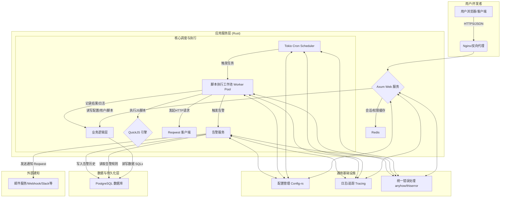

# 网站可用性监控系统设计方案

## 目录

- [1. 整体系统架构](#1-整体系统架构)
- [2. 核心模块设计](#2-核心模块设计)
- [3. 数据库表结构设计](#3-数据库表结构设计)
- [4. 项目结构与开发任务拆解](#4-项目结构与开发任务拆解)

## 1. 整体系统架构

本系统采用分层、模块化的架构，确保高内聚、低耦合，便于开发、维护和扩展。核心由两大部分组成：**API服务** 和 **调度执行服务**，它们共享数据库和缓存。

### 1.1 架构图



#### 1.2 架构说明

1. **API服务 (Axum Web Service)**：
    - **职责**：提供RESTful API，用于前端或客户端进行所有管理操作，如用户管理、脚本配置、查看报表和日志等。
    - **交互**：接收外部HTTP请求，通过业务逻辑层操作数据，利用Redis进行会话和热点数据缓存。
    - **实现**：使用 `Axum` 构建，所有路由和服务均在 `main.rs` 或 `app` 模块中定义和组织。

2. **调度执行服务 (Scheduler & Worker)**：
    - **职责**：系统的核心引擎。定时从数据库加载需要执行的监控脚本，并在独立的工作线程（或任务）中执行它们。
    - **调度器 (`tokio-cron-scheduler`)**：在服务启动时，从数据库加载所有启用的脚本及其调度规则（Cron表达式），并创建定时任务。
    - **工作池 (Worker Pool)**：当调度器触发任务时，从池中取一个Worker（一个Tokio Task）来执行。这可以控制并发执行的脚本数量，防止系统过载。
    - **脚本执行 (`QuickJS` + `Reqwest`)**：每个Worker内嵌一个`QuickJS`实例，用于执行用户定义的JS脚本。脚本中可以通过注入的`fetch`等函数（内部使用`Reqwest`实现）来监控目标网站。执行结果、日志、性能指标被收集。

3. **数据持久化 (PostgreSQL & Redis)**：
    - **PostgreSQL (`SQLx`)**：作为主数据库，存储所有核心数据，如用户、脚本、执行历史、告警规则等。`SQLx`提供编译时检查的SQL查询，保证类型安全。
    - **Redis**：用作高速缓存。主要缓存用户会话令牌、权限信息、频繁访问的配置等，以减轻数据库压力。

4. **告警服务 (Alerting Service)**：
    - **职责**：脚本执行后，如果结果满足告警规则（如状态码非200、响应时间超限、关键字未找到），则触发告警。
    - **实现**：告警服务可以是一个独立的模块。它从数据库中读取与脚本关联的告警规则，并使用`Reqwest`调用外部通知服务（如邮件API、Webhook）。

### 2. 核心模块设计

我们将按照您提供的模块列表进行详细设计。

#### 示例代码 (Axum路由)

```rust
// 用户认证路由示例
async fn auth_routes() -> Router {
    Router::new()
        .route("/api/v1/auth/register", post(register))
        .route("/api/v1/auth/login", post(login))
}

// 脚本执行路由示例
async fn script_routes() -> Router {
    Router::new()
        .route("/api/v1/scripts", get(list_scripts))
        .route("/api/v1/scripts/:id", get(get_script))
}
```

#### 2.1 用户与权限模块 (User & Permission)

- **功能描述**:
  - **用户管理**: 注册、登录、注销、信息修改、用户列表。
  - **角色管理**: 创建、删除、修改角色。
  - **权限管理**: 定义系统中的原子操作权限（如：`script:create`, `script:read`, `user:manage`）。
  - **权限分配**: 将权限分配给角色，将角色分配给用户（RBAC模型）。
- **核心接口设计 (RESTful API)**:
  - `POST /api/v1/auth/register` - 用户注册
  - `POST /api/v1/auth/login` - 用户登录 (返回JWT)
  - `POST /api/v1/auth/logout` - 用户注销
  - `GET /api/v1/users/me` - 获取当前用户信息
  - `GET /api/v1/users` - 获取用户列表 (管理员)
  - `POST /api/v1/roles` - 创建角色 (管理员)
  - `GET /api/v1/permissions` - 获取所有权限定义 (管理员)
  - `POST /api/v1/scripts/{script_id}/run` - 立即运行脚本
  - `POST /api/v1/roles/{role_id}/permissions` - 为角色分配权限 (管理员)
- **技术选型说明**:
  - `Axum`: 用于构建API路由和处理器。
  - `jsonwebtoken`: 用于生成和验证JWT，实现无状态认证。
  - `argon2`/`bcrypt`: 用于密码哈希存储，确保密码安全。
  - `SQLx`: 操作`users`, `roles`, `permissions`等相关数据表。
  - `Redis`: 缓存用户会话和权限信息，在请求中间件中快速验证权限。

#### 2.2 脚本相关模块 (Script, Template, Parameter, Env)

这是系统的核心业务模块，设计上需要高度灵活和解耦。

- **功能描述**:
  - **脚本模板**: 提供预设的监控脚本模板（如：HTTP GET健康检查、关键字检查），用户可以基于模板快速创建脚本。
  - **脚本管理**: 用户创建、编辑、删除、启用/禁用自己的监控脚本。脚本内容为JavaScript代码。
  - **脚本参数**: 为每个脚本定义动态参数（如：URL、超时时间），执行时传入脚本。这使得脚本本身可以通用。
  - **环境变量**: 定义全局或项目级的环境变量（如：通用API_KEY），可以在所有脚本中访问。
- **核心接口设计**:
  - `GET /api/v1/script-templates` - 获取所有脚本模板
  - `POST /api/v1/scripts` - 基于模板或空模板创建新脚本
  - `GET /api/v1/scripts` - 获取用户可见的脚本列表
  - `GET /api/v1/scripts/{script_id}` - 获取脚本详情（包括其参数和环境变量）
  - `PUT /api/v1/scripts/{script_id}` - 更新脚本
  - `DELETE /api/v1/scripts/{script_id}` - 删除脚本
- **技术选型说明**:
  - **脚本内容** (`script_body`): 存储在PostgreSQL的 `TEXT` 字段。
  - **参数/环境变量** (`parameters`/`env_vars`): 存储在PostgreSQL的 `JSONB` 字段，提供灵活性和查询能力。
  - **调度规则** (`cron_expression`): 存储为 `VARCHAR`，由 `tokio-cron-scheduler` 解析。

#### 2.3 脚本引擎与执行模块 (Engine, Execution, Log)

- **功能描述**:
  - **脚本引擎管理**: 初始化和管理`QuickJS`运行时池。
  - **脚本执行**: 调度器触发后，从数据库获取脚本、参数、环境变量，注入`QuickJS`上下文并执行。
  - **结果处理**: 捕获脚本的返回值（如：`{ success: true, latency: 120, data: {...} }`）、`console.log`输出和异常。
  - **日志记录**: 将每次执行的详细信息（时间、状态、结果、日志输出）存入数据库。
  - **硬性超时控制**: 在Rust的worker.rs中，执行每个JS脚本的tokio::task都应该被一个tokio::time::timeout包裹。无论JS脚本内部如何设置超时，Rust层必须有一个最终的、不可逾越的超时限制（例如30秒），超时则强制终止任务并记录为timeout状态。
  - **`reqwest`客户端强化**: 为注入到JS环境的`fetch`函数所使用的`reqwest::Client`进行特殊配置：
    - 禁止重定向到本地或私有IP地址。可以自定义重定向策略。
    - 明确禁止`file://`协议。
    - 可以考虑设置DNS解析器，以进一步控制可访问的域名。
  - **资源限制**: QuickJS引擎本身支持设置内存限制和执行指令数限制（stack size/interrupt handler）。在执行前设置这些限制，可以有效防止内存溢出和CPU密集型的死循环攻击。
- **内部流程 (非API)**:
    1. `tokio-cron-scheduler` 触发一个 `job_id` (对应 `script_id`)。
    2. 调度器 `spawn` 一个新的 `tokio::task` 来处理该 `job`。
    3. 该 `task` 从数据库加载 `scripts`, `script_parameters` 等所有相关信息。
    4. 创建一个沙箱化的 `QuickJS` 运行时实例。
    5. 向 `QuickJS` 上下文注入必要的全局函数和变量：
        - `fetch(url, options)`: 内部使用 `reqwest` 实现。
        - `env`: 包含所有可用环境变量的JS对象。
        - `params`: 包含脚本特定参数的JS对象。
        - `console.log/error`: 捕获其输出，存入执行日志。
    6. 执行脚本代码。
    7. 将执行结果（成功/失败、返回值、耗时、日志）写入 `script_executions` 和 `script_execution_logs` 表。
    8. 调用告警模块检查是否需要告警。
- **技术选型说明**:
  - `rquickjs` 或 `quick-js-rs`: `QuickJS` 的Rust绑定库。选择`rquickjs`，因为它提供了更安全和更符合人体工程学的API。
  - `tokio`: 用于并发执行脚本任务，避免阻塞调度器。
  - `reqwest`: 在脚本的`fetch`函数内部，发起实际的HTTP请求。

#### 2.4 告警与报表模块 (Alert & Report)

- **功能描述**:
  - **告警管理**: 用户为脚本配置告警规则（如：当`success`为`false`连续3次时，或当`latency > 500`时）。
  - **告警生成**: 执行后，匹配告警规则，若满足条件，生成告警事件，并存入历史记录。
  - **通知发送**: 通过不同渠道（Webhook、Email）发送告警通知。
  - **报表管理**: 定义报表（如：某脚本过去24小时的可用率和平均响应时间）。
  - **报表生成**: 定时或按需聚合`script_executions`表中的数据，生成报表视图或文件。
- **核心接口设计**:
  - `POST /api/v1/scripts/{script_id}/alert-rules` - 为脚本创建告警规则
  - `GET /api/v1/alerts/history` - 查看告警历史
  - `GET /api/v1/reports/{report_id}/data` - 获取报表数据
- **技术选型说明**:
  - **告警规则** (`alert_rules`): 存储在`JSONB`或专用字段中，便于灵活定义。
  - **告警状态机**: 可以在`Redis`中跟踪连续失败次数等状态，避免每次都查询数据库。
  - **报表聚合**: 利用PostgreSQL强大的聚合函数 (`AVG`, `COUNT`, `percentile_cont`) 来高效生成报表数据。对于复杂报表，可以考虑使用物化视图。

### 3. 数据库表结构设计 (PostgreSQL)

```sql
-- 开启 pgcrypto 扩展，用于生成 UUID
CREATE EXTENSION IF NOT EXISTS "pgcrypto";

-- 用户、角色、权限 (RBAC)
CREATE TABLE users (
    id UUID PRIMARY KEY DEFAULT gen_random_uuid(),
    username VARCHAR(50) UNIQUE NOT NULL,
    email VARCHAR(100) UNIQUE NOT NULL,
    password_hash VARCHAR(255) NOT NULL,
    created_at TIMESTAMPTZ NOT NULL DEFAULT NOW(),
    updated_at TIMESTAMPTZ NOT NULL DEFAULT NOW()
);

CREATE TABLE roles (
    id UUID PRIMARY KEY DEFAULT gen_random_uuid(),
    name VARCHAR(50) UNIQUE NOT NULL,
    description TEXT
);

CREATE TABLE permissions (
    id UUID PRIMARY KEY DEFAULT gen_random_uuid(),
    name VARCHAR(100) UNIQUE NOT NULL, -- e.g., 'script:create', 'user:manage'
    description TEXT
);

CREATE TABLE user_roles (
    user_id UUID NOT NULL REFERENCES users(id) ON DELETE CASCADE,
    role_id UUID NOT NULL REFERENCES roles(id) ON DELETE CASCADE,
    PRIMARY KEY (user_id, role_id)
);

CREATE TABLE role_permissions (
    role_id UUID NOT NULL REFERENCES roles(id) ON DELETE CASCADE,
    permission_id UUID NOT NULL REFERENCES permissions(id) ON DELETE CASCADE,
    PRIMARY KEY (role_id, permission_id)
);

-- 脚本模板
CREATE TABLE script_templates (
    id UUID PRIMARY KEY DEFAULT gen_random_uuid(),
    name VARCHAR(100) NOT NULL,
    description TEXT,
    script_body TEXT NOT NULL, -- 模板的JS代码
    created_at TIMESTAMPTZ NOT NULL DEFAULT NOW()
);

-- 脚本核心表
CREATE TABLE scripts (
    id UUID PRIMARY KEY DEFAULT gen_random_uuid(),
    name VARCHAR(100) NOT NULL,
    owner_id UUID NOT NULL REFERENCES users(id) ON DELETE CASCADE,
    is_enabled BOOLEAN NOT NULL DEFAULT true,
    cron_expression VARCHAR(100) NOT NULL, -- e.g., '0 */5 * * * *' (every 5 minutes)
    script_body TEXT NOT NULL,
    parameters JSONB, -- { "url": "https://example.com", "timeout": 5000 }
    env_vars JSONB,   -- 脚本执行时可用的环境变量
    created_at TIMESTAMPTZ NOT NULL DEFAULT NOW(),
    updated_at TIMESTAMPTZ NOT NULL DEFAULT NOW()
);
CREATE INDEX idx_scripts_owner_id ON scripts(owner_id);
CREATE INDEX idx_scripts_is_enabled ON scripts(is_enabled);


-- 脚本执行历史
CREATE TABLE script_executions (
    id BIGSERIAL PRIMARY KEY,
    script_id UUID NOT NULL REFERENCES scripts(id) ON DELETE CASCADE,
    executed_at TIMESTAMPTZ NOT NULL DEFAULT NOW(),
    duration_ms INTEGER NOT NULL, -- 执行耗时
    status VARCHAR(20) NOT NULL, -- 'success', 'failure', 'timeout'
    result JSONB, -- 脚本返回的结构化数据
    created_at TIMESTAMPTZ NOT NULL DEFAULT NOW()
);
CREATE INDEX idx_executions_script_id_executed_at ON script_executions(script_id, executed_at DESC);
CREATE INDEX idx_executions_status ON script_executions(status);

-- 脚本执行日志
CREATE TABLE script_execution_logs (
    id BIGSERIAL PRIMARY KEY,
    execution_id BIGINT NOT NULL REFERENCES script_executions(id) ON DELETE CASCADE,
    log_level VARCHAR(10) NOT NULL, -- 'info', 'error'
    message TEXT NOT NULL,
    timestamp TIMESTAMPTZ NOT NULL
);
CREATE INDEX idx_logs_execution_id ON script_execution_logs(execution_id);


-- 告警模块
CREATE TABLE alert_rules (
    id UUID PRIMARY KEY DEFAULT gen_random_uuid(),
    script_id UUID NOT NULL REFERENCES scripts(id) ON DELETE CASCADE,
    name VARCHAR(100) NOT NULL,
    -- 规则定义，JSONB非常灵活
    -- e.g., { "type": "status_change", "consecutive_failures": 3 }
    -- e.g., { "type": "latency", "threshold_ms": 1000, "operator": ">" }
    rule_definition JSONB NOT NULL,
    is_enabled BOOLEAN NOT NULL DEFAULT true,
    created_at TIMESTAMPTZ NOT NULL DEFAULT NOW()
);
CREATE INDEX idx_alert_rules_script_id ON alert_rules(script_id);

-- Add a join table
CREATE TABLE alert_rule_channels (
    rule_id UUID NOT NULL REFERENCES alert_rules(id) ON DELETE CASCADE,
    channel_id UUID NOT NULL REFERENCES notification_channels(id) ON DELETE CASCADE,
    PRIMARY KEY (rule_id, channel_id)
);

CREATE TABLE alert_history (
    id BIGSERIAL PRIMARY KEY,
    rule_id UUID NOT NULL REFERENCES alert_rules(id) ON DELETE RESTRICT,
    execution_id BIGINT REFERENCES script_executions(id) ON DELETE SET NULL,
    triggered_at TIMESTAMPTZ NOT NULL DEFAULT NOW(),
    details JSONB -- 触发时的快照信息
);

CREATE TABLE notification_channels (
    id UUID PRIMARY KEY DEFAULT gen_random_uuid(),
    owner_id UUID NOT NULL REFERENCES users(id),
    name VARCHAR(100) NOT NULL,
    type VARCHAR(50) NOT NULL, -- 'webhook', 'email', 'slack'
    config JSONB NOT NULL, -- { "url": "...", "headers": {...} } or { "email": "..." }
    created_at TIMESTAMPTZ NOT NULL DEFAULT NOW()
);
```

### 4. 项目结构与开发任务拆解

#### 4.1 建议项目结构 (Cargo Workspace)

```
website-monitor/
├── Cargo.toml          # a [workspace] manifest
├── .env.example
├── config/
│   ├── default.toml
│   └── production.toml
├── migrations/         # SQLx migrations
├── crates/
│   ├── monitor-api/      # The Axum application crate
│   │   ├── src/
│   │   │   ├── main.rs
│   │   │   ├── routes/
│   │   │   ├── handlers/
│   │   │   └── models.rs
│   │   └── Cargo.toml
│   ├── monitor-core/     # Shared logic, structs, errors
│   │   ├── src/
│   │   │   ├── error.rs
│   │   │   └── types/
│   │   └── Cargo.toml
│   ├── monitor-scheduler/ # The scheduler and execution worker crate
│   │   ├── src/
│   │   │   ├── main.rs   # Binary entrypoint for the scheduler process
│   │   │   ├── scheduler.rs
│   │   │   └── worker.rs
│   │   └── Cargo.toml
│   └── monitor-scripting/ # Scripting engine (QuickJS) abstraction
│       ├── src/
│       │   ├── lib.rs
│       │   └── engine.rs
│       └── Cargo.toml
└── README.md
```

#### 4.2 开发任务拆解 (可按阶段进行)

**第一阶段：基础建设**

1. **任务1**: 初始化Cargo Workspace项目结构。
2. **任务2**: 引入 `tracing` 日志，`config-rs` 配置，`anyhow/thiserror` 错误处理，并建立 `monitor-core` crate。
3. **任务3**: 使用 `sqlx-cli` 建立数据库连接并编写第一版数据库迁移脚本（用户与权限表）。
4. **任务4**: 在 `monitor-api` 中搭建基础Axum服务，实现健康检查接口 `/health`。

**第二阶段：核心监控功能**

1. **任务5**: 在 `monitor-scripting` crate 中封装 `rquickjs`，提供一个安全的沙箱化执行环境。
2. **任务6**: 编写数据库迁移脚本，创建脚本相关表 (`scripts`, `script_templates` 等)。
3. **任务7**: 在 `monitor-scheduler` crate 中实现调度逻辑。能从数据库加载启用的脚本，并使用 `tokio-cron-scheduler` 按时打印一条日志（表示任务触发）。
4. **任务8**: 实现 `worker.rs`，集成 `monitor-scripting`，使其能真正执行一个简单的硬编码JS脚本（如`console.log('hello')`）。
5. **任务9**: 完善 `worker`，使其能执行数据库中定义的脚本，并能使用 `reqwest` 发起HTTP请求。
6. **任务10**: 编写数据库迁移脚本，创建执行历史和日志表，并将执行结果存入数据库。

**第三阶段：API与用户界面支持**

1. **任务11**: 在 `monitor-api` 中实现完整的用户注册、登录（JWT）和权限管理API。
2. **任务12**: 实现脚本模板、脚本、参数等模块的CRUD API。
3. **任务13**: 实现查看脚本执行历史和日志的API。

**第四阶段：告警与报表**

1. **任务14**: 编写数据库迁移脚本，创建告警规则和历史表。
2. **任务15**: 在 `worker` 的执行流程后，增加告警检查逻辑。
3. **任务16**: 实现一个通知发送服务，初期支持Webhook。
4. **任务17**: 实现告警规则的CRUD API。
5. **任务18**: 设计并实现基础的报表查询API（如可用率、平均响应时间）。

**第五阶段：完善与部署**

1. **任务19**: 编写全面的单元测试和集成测试 (`cargo test`)。
2. **任务20**: 完善文档，包括API文档和部署指南。
3. **任务21**: 创建Dockerfile，为生产环境部署做准备。

## 5. 部署与运维指南

### 5.1 生产环境部署

1. **Docker部署**

```dockerfile
FROM rust:1.60 as builder
WORKDIR /app
COPY . .
RUN cargo build --release

FROM debian:bullseye-slim
COPY --from=builder /app/target/release/monitor-api /usr/local/bin/
CMD ["monitor-api"]
```

2. **Kubernetes示例配置**

```yaml
apiVersion: apps/v1
kind: Deployment
metadata:
  name: monitor-api
spec:
  replicas: 3
  template:
    spec:
      containers:
      - name: monitor
        image: your-registry/monitor-api:latest
        envFrom:
        - configMapRef:
            name: monitor-config
```

### 5.2 监控与告警

- **Prometheus指标端点**: `/metrics`
- **关键指标**:
  - `script_execution_duration_seconds` (直方图)
  - `script_execution_total` (计数器)
  - `http_requests_total` (计数器)
  - `script_success_rate` (成功率)
  - `alert_triggered_total` (告警触发次数)

#### 性能优化建议

1. **脚本执行优化**

```rust
// 使用tokio::spawn并行执行独立脚本
tokio::spawn(async {
    execute_script(script).await;
});
```

2. **数据库查询优化**

```sql
-- 为频繁查询的字段添加索引
CREATE INDEX idx_script_executions_status ON script_executions(status);

-- 使用物化视图加速报表查询
CREATE MATERIALIZED VIEW script_daily_stats AS
SELECT 
    script_id,
    AVG(duration_ms) as avg_duration,
    COUNT(*) FILTER (WHERE status = 'success') / COUNT(*)::float as success_rate
FROM script_executions
GROUP BY script_id, date_trunc('day', executed_at);
```

### 5.3 备份与恢复

```bash
# 数据库备份
pg_dump -U postgres monitor_db > backup.sql

# 恢复
psql -U postgres monitor_db < backup.sql
```

## 6. 安全最佳实践

### 6.1 认证与授权

- 使用 `argon2` 或 `bcrypt` 存储密码哈希
- JWT 令牌使用强密钥 (HS256 或 RS256)
- 实现基于角色的访问控制 (RBAC)

### 6.2 脚本执行安全

```rust
// QuickJS 安全配置示例
let mut ctx = Context::builder()
    .memory_limit(1024 * 1024) // 1MB 内存限制
    .stack_size(1024 * 128)   // 128KB 栈限制
    .build()?;

// 禁用危险API
ctx.disable_extension("eval");
ctx.disable_extension("module");
```

### 6.3 网络安全

- 使用 HTTPS 加密所有 API 通信
- 配置 CORS 白名单
- 限制 HTTP 请求大小

### 6.4 数据安全

- 加密敏感环境变量
- 定期轮换数据库凭据
- 实现审计日志
